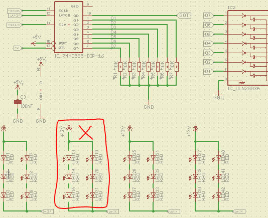
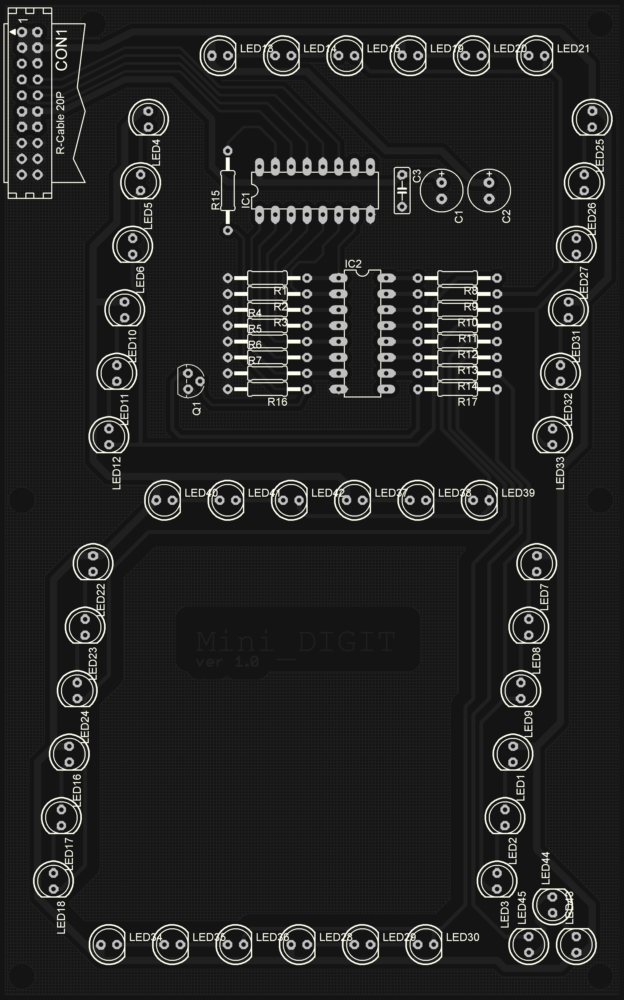
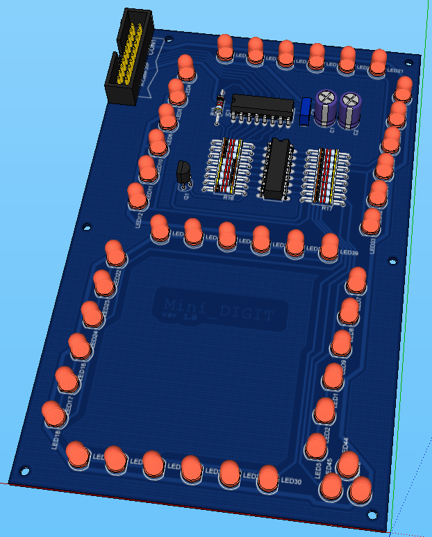
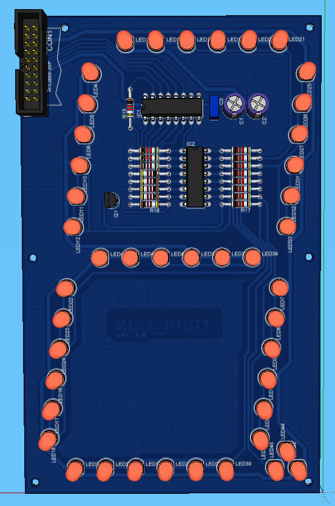

DIGIT MINI
====================

Schema elettrico e pcb di un mini digit a led 
controllato con shift register 74HC595

Per la visualizzazione dei file `sch e brd` 
usare eagle, programma per il design di pcb.

Per la visualizzazione del file 3D `eagleUp/mini_digit.skp`
usare il programma google sketchup.

	git clone git@github.com:damnemo/digit_mini.git
	git clone git://github.com/damnemo/digit_mini.git

## SOFTWARE DA INSTALLARE
 1. `Eagle` , cad for pcb design
 2. `Sketchup` , per modellazione 3D

### EAGLE SCHEMA
NOTA: Diodi in parallelo possono avere delle tensioni 
di soglia un po' diverse e quindi la polarizzazione può 
essere leggermente dissimmetrica... si consiglia di mettere
una resistenza per ogni ramo e non una per entrambi i rami.

### BOARD BOTTOM

### 3D IMAGE CON GOOGLE SKETCHUP

